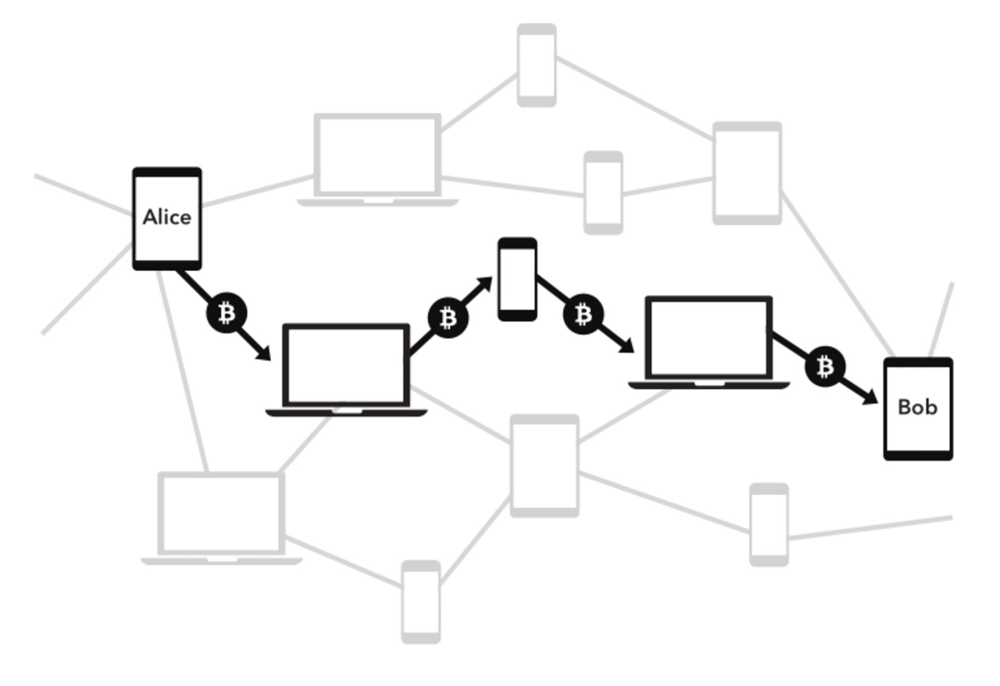

# Overview

This overview assumes basic knowledge of Bitcoin mechanics. If terms like “UTXO” and “locktime” are unfamiliar to you, you should refer to the [Bitcoin developer guide](https://bitcoin.org/en/developer-guide), which serves a similar purpose.

The Lightning Network scales blockchains and enables trustless instant payments by keeping most transactions off-chain and leveraging the security of the underlying blockchain as an arbitration layer.

‌This is accomplished primarily through “payment channels”, wherein two parties commit funds and pay each other by updating the balance redeemable by either party in the channel. This process is instant and saves users from having to wait for block confirmations before they can render goods or services.

Payment channels are considered trustless, since any attempt to defraud the current agreed-upon balance in the channel results in the complete forfeiture of funds by the liable party.

By moving payments off-chain, the cost of opening and closing channels \(in the form of on-chain transaction fees\) is amortized over the volume of payments in that channel, enabling micropayments and small-value transactions for which the on-chain transaction fees would otherwise be too expensive to justify. Furthermore, the Lightning Network scales not with the transaction throughput of the underlying blockchain, but with modern data processing and latency limits - payments can be made nearly as quickly as packets can be sent.

Hash Time-Locked Contracts \(HTLCs\) allow transactions to be sent between parties who do not have a direct channel by routing them through multiple hops, so anyone connected to the Lightning Network is part of a single, interconnected global financial system.

In short, the Lightning Network enables scalable blockchains through a high-volume of instant transactions not requiring custodial delegation.

